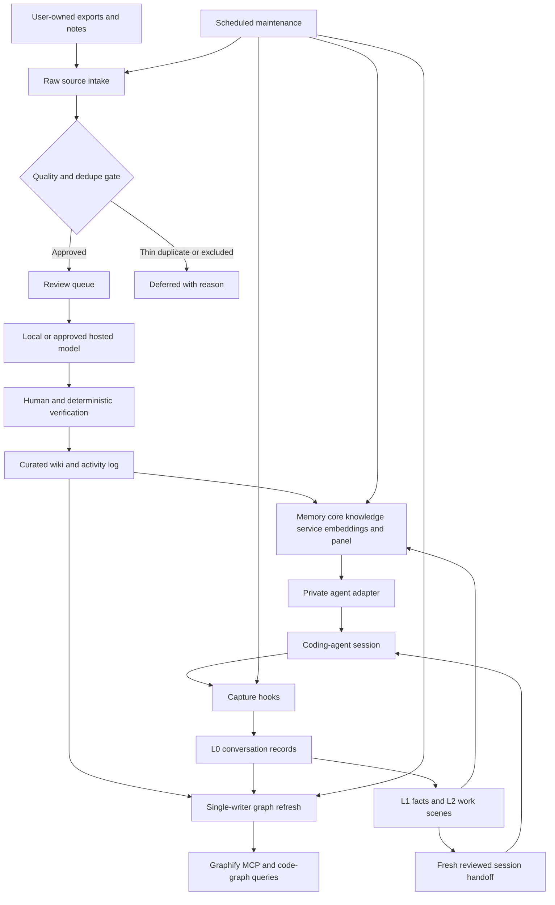

# Memory Hub

A private-by-default, cloneable operating system for an agent-assisted knowledge
vault. It combines TencentDB Agent Memory, a sourced wiki, session memory,
Graphify/code graphs, local or hosted model lanes, an optional panel, and
scheduled maintenance—without committing personal data, credentials, hosts, or
live routing configuration.

## Repository structure

```text
bootstrap/       empty-state templates and migration checklist
raw/             immutable user-owned source intake
wiki/            sourced pages, index, templates, activity log
projects/        reusable operating documents
hooks/           capture, recall, sweep, and persona utilities
tools/           intake, queue, wiki, graph, and model-router tools
automation/      stale-page, graph, container, and vault-cycle maintenance
mcp/             local progressive-discovery catalog
skills/          detailed agent workflows
.claude/commands/ database-backed procedures only
deploy/           containers, router, and scheduler templates
vendor/           TencentDB Agent Memory upstream submodule
```

## System flow

```text
approved exports → raw/ → queue → model/human curation → wiki
agent sessions → hooks → L0 → L1 facts + L2 scenes → bounded handoff
approved wiki + code/conversations → one graph writer → Graphify MCP
memory-core + knowledge + embeddings + optional panel → private agent adapter
```

Hooks capture memory; they do not automatically create wiki pages. Wiki content
is created only through reviewed ingestion with source provenance.

The running deployment is multi-machine: coding-agent clients and a local
Graphify MCP connect through a private tailnet to an always-on memory/knowledge
host, which may use separate trusted accelerator hosts through the tiered model
router. Read the [system integration map](docs/operations/system-integrations.md)
and [Tailnet deployment boundary](deploy/tailnet/README.md) before configuring
your own network.

## How it works



## Quick start

1. Clone with upstream services: `git clone --recurse-submodules <repository>`.
2. Read [CLAUDE.md](CLAUDE.md), [AGENTS.md](AGENTS.md), and the
   [setup tutorial](docs/setup/tutorial.md).
3. Add only your own exports under `raw/`.
4. Deploy the upstream components with [TencentDB setup](docs/setup/tencentdb-agent-memory.md).
5. Select embeddings and model lanes with [embedding](docs/operations/embeddings.md)
   and [model policy](docs/operations/model-lane.md).
6. Register Claude or Codex using [agent integration](docs/claude-and-codex.md)
   and implement a protected [private adapter](docs/setup/private-adapter.md).
7. Register and test only the needed jobs from [schedulers](deploy/schedulers/README.md).

## Operations

| Need | Procedure or tool |
| --- | --- |
| Collect exports | `/pull-sourcesDB`, `tools/source_intake.py` |
| Triage / curate | `/triageDB`, `/ingestDB`, `tools/ingest_queue.py` |
| Log / audit | `/logDB`, `/lintDB`, `tools/wiki_maintenance.py` |
| Retrieve knowledge | `/queryDB`, Graphify MCP, private memory adapter |
| Maintain state | `automation/stale_pages.py`, `automation/graph_refresh.py` |
| Reconcile services | `automation/container_reconcile.py --apply` |
| Run safe local cycle | `automation/vault_cycle.py` |

## Models, privacy, and private code

Local models suit sensitive embeddings, extraction, summaries, and bounded
classification. Hosted research lanes may handle explicitly approved
non-sensitive research, never private raw sources by default. Models propose;
source evidence and deterministic validation decide durable knowledge.

The reference embedding model is `nomic-embed-text-v1.5` at 768 dimensions.
Changing its identity requires re-embedding all vectors. For private repository
graphs, build beside a trusted checkout or use a dedicated read-only identity
outside Git. See [private code graphs](docs/setup/private-code-graphs.md).

## Publication gate

```sh
python3 -m unittest discover -s tests
python3 tools/audit_release.py .
```

Also run a secret scanner and manual review before changing repository visibility.
